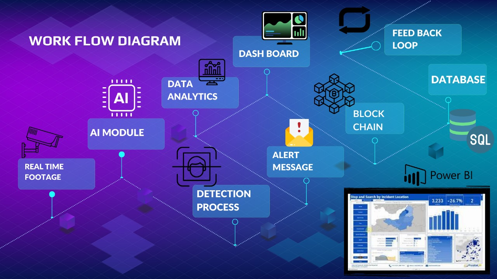
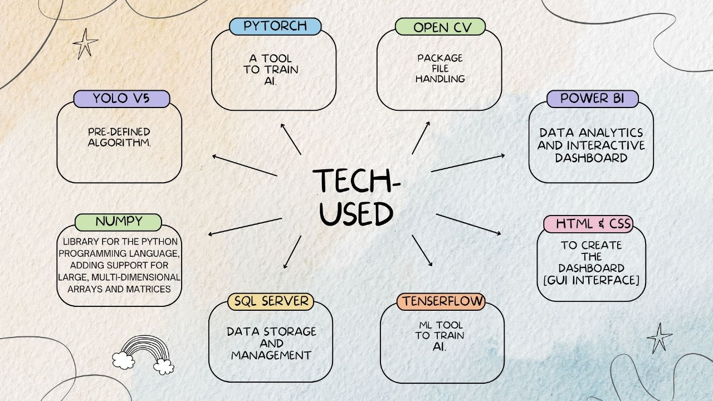

# Real-Time AI-Based Intelligent Camera Decision Making

## Overview

Our AI-based intelligent camera system is designed to detect and respond to critical situations in real-time. We have trained our AI models to identify instances of blood, fire, and violence using TensorFlow. Specifically, we utilized YOLOv3 for pistol detection and face_recognition (built on dlib) for face detection. The models have been fine-tuned to ensure accurate and efficient detection.

## WorkFlow and Tech Stack

## Features

- **Real-time Detection:** Our AI models operate in real-time, providing immediate responses to potential threats.
- **Multi-Object Detection:** The system can identify various objects, including pistols, faces, blood, and fire.
- **Database Integration:** Detected incidents are seamlessly updated in the database, ensuring a comprehensive record.

## Dashboard and Authentication

Our web-based front-end interface includes a login system for both administrators and officers. This system is built using HTML, CSS, JS, and PHP, offering a user-friendly and interactive dashboard. 

## Requirements

Ensure the following dependencies are installed for the proper functioning of our system:

- PHP
- Microsoft SQL Server
- Power BI Report Server
- Power BI Desktop
- MySQL
- MySQL extension for PHP
- Python
- TensorFlow
- OpenCV
- dlib
- face_recognition
- MySQL Connector for Python
