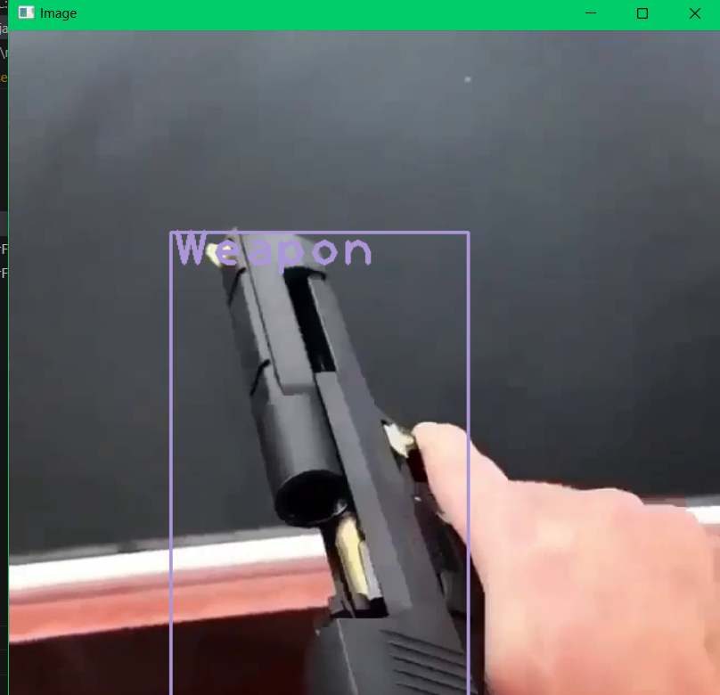
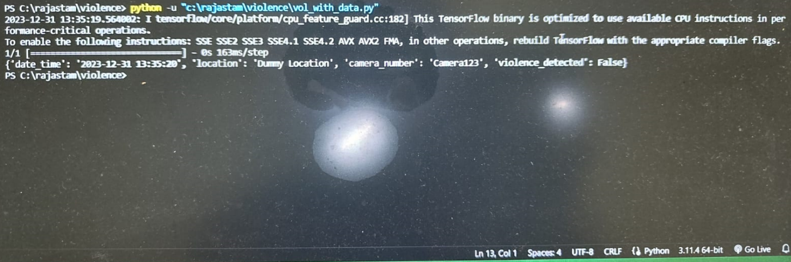
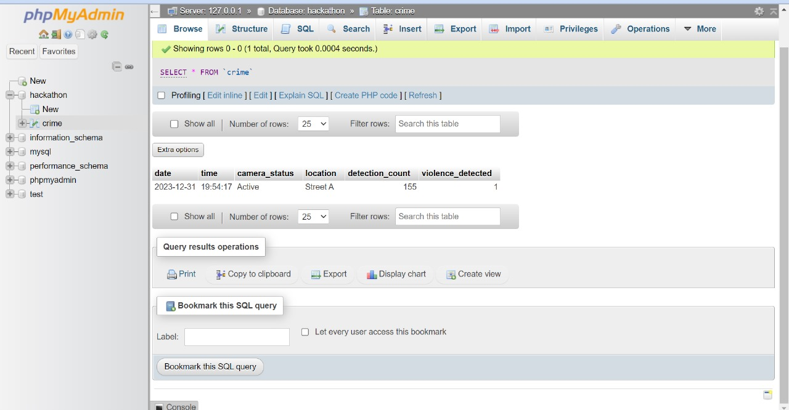

# Real-Time AI-Based Intelligent Camera Decision Making

## Overview

As of now, we have created a web-based front-end interface with the use of HTML/CSS. We have also trained our AI model to detect gun with the help of YOLOv5 Model. It has been fine tuned to detect objects accurately.We have made use of a accurate dataset to train a AI model which detects violence.

## Sample Output

